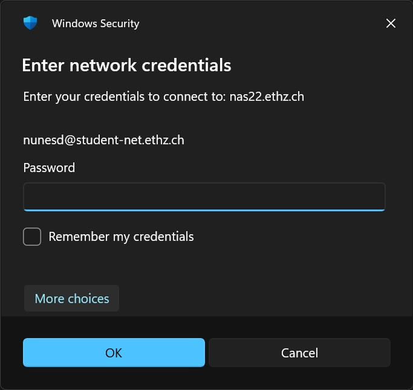
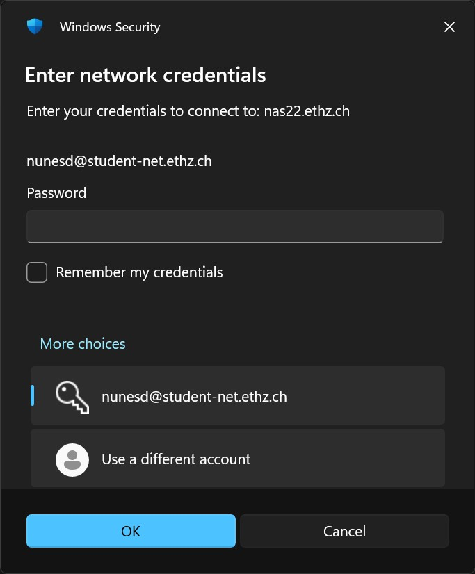
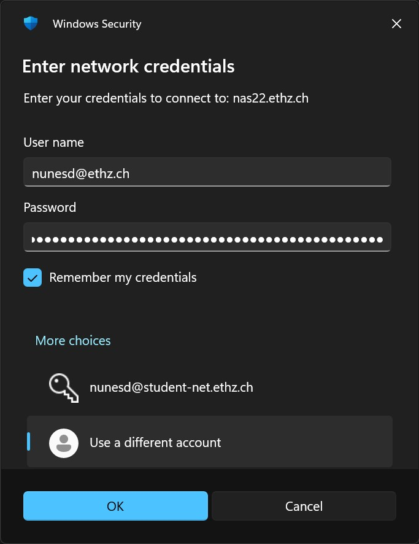
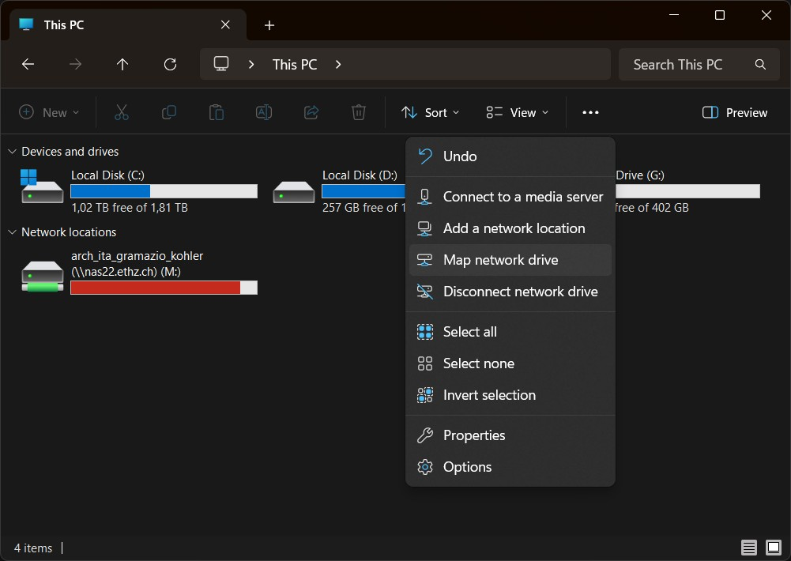
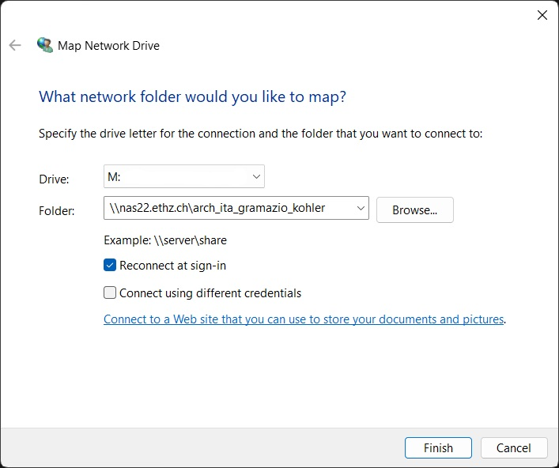
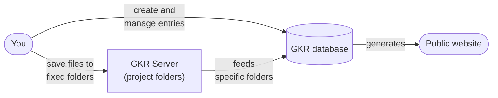

# Gramazio Kohler Research — Onboarding

A practical onboarding guide for **Gramazio Kohler Research**, ETH Zürich — accounts, tools, people, and the gotchas the official docs miss.

> Community-maintained — please keep it current for the next person.

## Prerequisites

This guide assumes you have already received the following from ETH:

| Item | Details |
| --- | --- |
| **Global email** | `<username>@ethz.ch` |
| **Department email** | `<username>@arch.ethz.ch` |
| **Global password** | Used for email, network drives, Google/Microsoft logins, etc. |
| **Network password** | Separate password used **only** for Wi-Fi / VPN / eduroam |

> **Both email addresses point to the same inbox/account.** You do not manage two separate mailboxes.

Every service signs you in as `<username>@ethz.ch` with your **global password**, except **Wi-Fi (eduroam) and VPN**, which use a role-dependent login and your **network password** (see [Wi-Fi](#31-wi-fi)).

## 1. First day at the office

Day one is light: get a **tour of the office** and get to know the **food & coffee options** on campus (below).

### 1.1 Food & coffee on campus

_Hours & menus shift each semester — see the [live page](https://ethz.ch/en/campus/getting-to-know/cafes-restaurants-shops/gastronomy/restaurants-and-cafeterias/hoenggerberg.html)._

- **[FUSION meal & coffee](https://maps.app.goo.gl/EuoSGRFboac5KGyY7)** — free-flow restaurant (classic/veg, pasta, buffet) + adjacent coffee shop; HCI building.
- **[Food Market](https://maps.app.goo.gl/zjg8U73At9AwHuJs8)** — SV (campus caterer) counter (pizza/pasta, grill, veg); HPR building.
- **[Alumni quattro Lounge](https://maps.app.goo.gl/cGtFkSMN6dCLm8Mj8)** — lounge café.
- **[Rice UP!](https://maps.app.goo.gl/5nKEjqt3zGEhrJY9A)** — Asian rice bowls.
- **[Mendokoro](https://maps.app.goo.gl/wgPFVYDUpktqSjxy7)** — Japanese ramen & snacks, takeaway; HXE building.
- **[Restaurant Bellavista](https://maps.app.goo.gl/wWmT2XTKVNs43WGVA)** — table-service restaurant, pricier option.
- **[Coop supermarket](https://maps.app.goo.gl/7Zzzgq639gCaZWWcA)** — on campus.
- **[Street food](https://ethz.ch/en/campus/getting-to-know/cafes-restaurants-shops/gastronomy/street-food.html)** — rotating food trucks, Mon–Fri from 11:00, seasonal (Aug–Dec). Vendors change each semester, so treat the grid below as a snapshot and check the link for the current line-up:
  - **[Stefano-Franscini-Platz](https://maps.app.goo.gl/NMJCScv9bo2ssMJC7)** — coffee & snacks
  - **[Joseph-von-Deschwanden-Platz](https://maps.app.goo.gl/iFgtBzVB6viNLat5A)** — hot meals

| Day | Stefano-Franscini-Platz | Joseph-von-Deschwanden-Platz |
| --- | --- | --- |
| **Mon** | Bar Caffetteria Otter | Caribbean Flair |
| **Tue** | Petit Frère + Äss-Bar | Ada Lokma (Anatolian) + Bra-Bro-Gourmet (burgers) |
| **Wed** | Miró Coffee + Äss-Bar | Wesley's Kitchen (Asian/momos) |
| **Thu** | Il Macchinista + Äss-Bar | Memo Food (kebab) + FAINO (Ukrainian) |
| **Fri** | Mate's Coffee + Äss-Bar | Mundo Del Gusto (burgers) |

## 2. Hardware

The group provides your workstation. When yours is being arranged, confirm you get:

- Laptop
- Screen
- Keyboard — check which layout you want (**US / DE / CH**)
- Mouse

## 3. Getting connected

### 3.1 Wi-Fi

Two things trip people up here: your username isn't any of your email addresses, and your password isn't your global password.

**Network** &nbsp;·&nbsp; `eduroam`

**Username** &nbsp;·&nbsp; your ETH username with a **role-specific domain** — *not* `@ethz.ch`:

| Your role | Wi-Fi username |
| --- | --- |
| Staff — professors, assistants, **post-docs**, technical staff | `<username>@staff-net.ethz.ch` |
| Student — incl. **PhD students** | `<username>@student-net.ethz.ch` |
| Visitor | `<username>@eth-visitors.ethz.ch` |

**Password** &nbsp;·&nbsp; your **network password** (Radius / Wi-Fi / VPN password). Set or reset it at <https://password.ethz.ch>.

On Linux and Android, eduroam needs extra configuration: [Wi-Fi (Linux and Android)](https://unlimited.ethz.ch/en/help/network/manuals-and-documentation/manuals-wlan-wifi/wifi-linux-and-android).

ETH also runs an `eth-iot` network for devices that can't join eduroam.

More details: <https://isg.inf.ethz.ch/Main/ServicesNetworkWireless>

### 3.2 Email & Calendar

**Outlook** is the recommended email client, it keeps you aligned with the rest of the team. You can use another client if you prefer, but Outlook is the smoothest path.

1. Go to <https://outlook.office.com/mail/>.
2. Enter your `@ethz.ch` email.
3. Sign in with your **global password**.

### 3.3 Network drives (GKR Server)

The **GKR Server** is the group's **file storage** — projects, documentation, images, videos, and templates all live here. It's also the foundation of the group website, through a rigid project folder structure — see [§5](#5-the-gkr-database).

Once you're connected via eduroam, you can reach the GKR Server:

```
\\nas22.ethz.ch\arch_ita_gramazio_kohler
```

**Detailed setup by OS:**

<details>
<summary><strong>Windows</strong></summary>

> ⚠️ **The first connection is slow and silent** — No feedback for ~2 minutes.

1. Open **File Explorer** and enter the address above and _wait_.
2. Click  **More choices** (don't accept the default account).
<figure>
  
  <figcaption><em>2a. The dialog opens pre-filled with your <strong>network account</strong>, which the GKR Server rejects. Click <strong>More choices</strong> at the bottom.</em></figcaption>
</figure>

<br />

<figure>
  
  <figcaption><em>2b. Select <strong>Use a different account</strong>.</em></figcaption>
</figure>

<br />

<figure>
  
  <figcaption><em>2c. Enter your <strong>global</strong> email and password, then tick <strong>Remember my credentials</strong> so you're not asked again.</em></figcaption>
</figure>

<br />

3. **(Recommended)** Map it as a network drive so it stays available and reconnects at sign-in.

<figure>
  
  <figcaption><em>3a. At <strong>This PC</strong>, click the three dots (…) and select <strong>Map network drive</strong>.</em></figcaption>
</figure>

<br />

<figure>
  
  <figcaption><em>3b. Fill in the dialog:</em>
    <ul>
      <li>In <strong>Drive</strong>, select the letter <code>M:</code> (or any other available letter).</li>
      <li>In <strong>Folder</strong>, enter <code>\\nas22.ethz.ch\arch_ita_gramazio_kohler</code>.</li>
      <li>Check <strong>Reconnect at sign-in</strong>.</li>
      <li>Check <strong>Connect using different credentials</strong>.</li>
    </ul>
  </figcaption>
</figure>

<br />

<figure>
  
  <figcaption><em>3c. Enter your global email and password.</em></figcaption>
</figure>

</details>

### 3.4 VPN

Needed to reach some internal services from outside the campus network.

- **Setup** &nbsp;·&nbsp; ETH VPN service page: <https://unlimited.ethz.ch/en/help/network/vpn>
- **Username** &nbsp;·&nbsp; the same role-based login as [Wi-Fi](#31-wi-fi) (e.g. `<username>@student-net.ethz.ch`)
- **Password** &nbsp;·&nbsp; your **network password**

## 4. Software ecosystem

Slack, GitHub and Zoom don't need a license request. Google and Microsoft licenses you have to request yourself through ETH's **Unlimited** self-service portal: <https://unlimited.ethz.ch/en/help>

### 4.1 Slack

The team will send an invite to your **`@arch.ethz.ch`** address. Accept it to join the group workspace.

### 4.2 GitHub

The team will send an invite to your **`@arch.ethz.ch`** address. Accept it to join the organization, and ask to be added to the project repositories you'll work on.

### 4.3 Zoom

Log in with your `@ethz.ch` email and password; you get a license automatically.

### 4.4 Google Workspace

1. Follow **"Google Workspace — Getting a License"**: <https://unlimited.ethz.ch/en/help/googlews/getting-started/first-steps>
2. Approval takes about **10 minutes**.
3. Once approved, log in to Google services with your `@ethz.ch` email and **global password**.
4. Ask the team to add you to the **shared project drives**.

### 4.5 Microsoft 365

1. Follow **"Requesting an M365 License"**: <https://unlimited.ethz.ch/en/help/m365/getting-started/m365-first-steps>
2. Approval takes about **5 minutes**.
3. Once approved, you can log in to **Teams** with your `@ethz.ch` email and **global password**.

### 4.6 Rhino

One person in the group handles Rhino licenses — ask them (or your supervisor) to get you set up.

> _TODO: name the person responsible for Rhino licenses._

### 4.7 Other tools

- **[Zotero](https://www.zotero.org/)** — reference manager.
- **[ORCiD](https://orcid.org/)** — persistent researcher identifier; worth registering if you'll publish.

### 4.8 Project folders

Set up your **project folder(s)** on the **GKR Server** (the group's main network drive) and in the Google Drive shared project drive. On the server, keep to the fixed project template — these folders feed the group website ([§5](#5-the-gkr-database)).

## 5. The GKR database

The **GKR database** is the group's content system: each project's descriptions, images, publications, events, and contacts live here, and the public website (<https://gramaziokohler.arch.ethz.ch/>) is **generated from it**.

You feed it from two directions:

- **Files** live on the **GKR Server** ([§3.3](#33-network-drives-gkr-server)), where every project follows a **fixed template**. Specific folders are synced from there into the database — so stick to the template and naming conventions exactly; don't rename or add folders, or the sync breaks.
- **Entries** — the project's text, captions, and image details — you **create and manage directly in the database**.

The database then generates the website from the two combined.



To get started, set up a **GKR database intro meeting** with Alessandra Gabaglio (gabaglio@arch.ethz.ch).

## 6. Coding

The group's computational stack is Python-centric and built around [COMPAS](https://compas.dev/index.html).

1. Install [git](https://git-scm.com/book/en/v2/Getting-Started-Installing-Git).
2. Install a code editor or IDE — [VS Code](https://code.visualstudio.com/) is the common choice.
3. Install Python via **Anaconda**, and get comfortable with virtual environments — one environment per project is the norm.
4. Bookmark the COMPAS resources:
   - [COMPAS documentation](https://compas.dev/index.html)
   - [COMPAS in Rhino](https://compas.dev/compas/latest/gettingstarted/rhino.html)
   - [Tutorials — COMPAS II](https://github.com/compas-teaching/COMPAS-II-FS2023) (FS2023 edition — check whether a newer one exists)
5. Set up a **coding guidelines** intro meeting with Gonzalo Casas (casas@arch.ethz.ch) or Chen Kasirer (kasirer@arch.ethz.ch).

## 7. Mailing lists & recurring meetings

**Mailing lists:**

- **GKR mailing list** — Tanja adds you.
- **NCCR mailing list** — if your project is part of the NCCR (Digital Fabrication).

**Recurring meetings** — ask to be added to the invites:

- Team meeting
- COMPAS dev meeting (bi-weekly)
- Weekly cross section

## 8. Building access & trainings

- **RFL** (Robotic Fabrication Laboratory) — access is granted only after an **in-person instruction by the RFL staff**. Arrange it through the **GKR RFL coordinator**, who is the first contact for anything RFL-related.
  - Working with concrete? The **RFL concrete lab** has its own instruction, given by the lab leader.
- **IDL** (Immersive Design Lab) — request access and training.
  > _TODO: not covered in the office manual — confirm who grants IDL access and how its training is scheduled._

## 9. Admin & perks

- **ETHIS** (ETH's administration portal) — where absences are recorded.
  > _TODO: confirm with Tanja whether presence time must be entered as well, or only absences._
- **Halbtax** — SBB half-fare travelcard; request it through Tanja. Details on the [ETH travel page](https://ethz.ch/staffnet/de/finanzen-und-controlling/reisen.html).
- **ETH Group Management (ACLs)** — access to shared resources is tied to ETH group memberships; ask your supervisor to add you to the relevant groups.
  > _TODO: list which groups a new member needs and who can add them._

## 10. Reading

- Read the **[office manual](https://github.com/gramaziokohler/gkr_office_manual/blob/main/office_manual.md)**.
- **New PhDs:** read the **PhD study guides** by ETH (received per email).

## Quick checklist

**Arrival & hardware**

- [ ] Office tour + campus food intro
- [ ] Hardware: laptop, screen, keyboard (US/DE/CH), mouse

**Getting connected**

- [ ] Connect to eduroam (role login, e.g. `@student-net.ethz.ch` + network password)
- [ ] Log in to Outlook (`@ethz.ch` + global password)
- [ ] Access and map the GKR Server (network drive)
- [ ] Set up the VPN

**Software & ecosystem**

- [ ] Accept the Slack invite (`@arch.ethz.ch`)
- [ ] Accept the GitHub invite (`@arch.ethz.ch`) and join the project repos
- [ ] Log in to Zoom (`@ethz.ch` + global password)
- [ ] Request Google Workspace license + get added to shared drives
- [ ] Request Microsoft 365 license
- [ ] Request the Rhino license
- [ ] Project folders on the GKR Server + Google Drive shared drive
- [ ] GKR database intro with Alessandra Gabaglio

**Coding**

- [ ] Dev environment: git, VS Code, Python/Anaconda, COMPAS links
- [ ] Coding guidelines intro with Gonzalo Casas / Chen Kasirer

**Settling in**

- [ ] GKR mailing list (Tanja); NCCR list if it applies
- [ ] Recurring meeting invites (team, COMPAS dev, cross section)
- [ ] RFL access & security training; IDL access & training
- [ ] ETHIS: clarify absence (and presence?) recording with Tanja
- [ ] Halbtax request (Tanja)
- [ ] Get added to the ETH groups (ACLs)
- [ ] Read the office manual
- [ ] (PhDs) Read the ETH PhD study guides

---

## Who is who

First contacts by topic.

| Where | Role | People |
| --- | --- | --- |
| **GKR** | Admin & finance | Tanja (fehr@arch.ethz.ch) |
| **GKR** | Postdocs | Oliver (bucklin@arch.ethz.ch), Lauren (vasey@arch.ethz.ch), Petrus (apetrus@arch.ethz.ch), Inés (ariza@arch.ethz.ch), Anja (akunic@ethz.ch) |
| **GKR** | PR & communication | Alessandra (gabaglio@arch.ethz.ch) |
| **GKR** | Teaching team | _TODO_ |
| **GKR** | Assistants | _TODO_ |
| **NCCR** | Management | Russell (loveridge@dfab.ch), Kaitlin (mcnally@dfab.ch), Blanca (hren@dfab.ch) |
| **NCCR** | Budget & expenses | Tanja (fehr@arch.ethz.ch), Blanca (hren@dfab.ch) |
| **NCCR** | Software ecosystem | Tom (van.mele@arch.ethz.ch), Chen (kasirer@arch.ethz.ch), Gonzalo (casas@arch.ethz.ch) |
| **RFL** | Lab team | Philippe, Mike, Toby |
| **ITA** | Coordinator, RQEs | _TODO_ |
